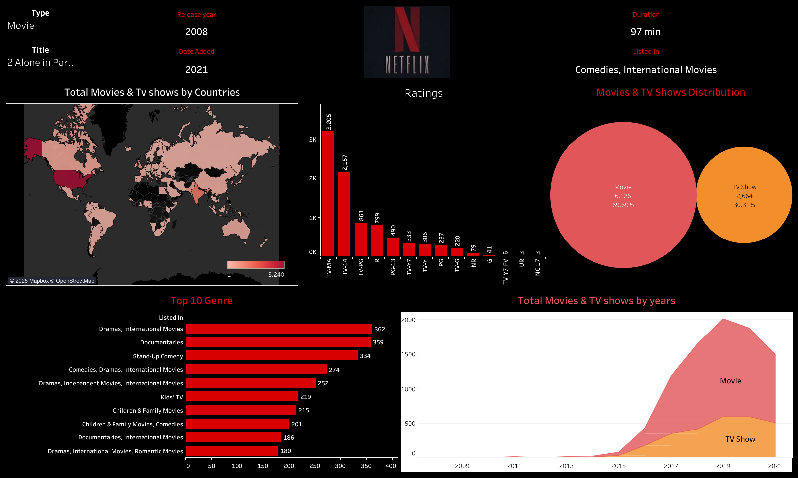

# Netflix Movies & TV Shows Dashboard (Tableau)

This project presents a comprehensive Tableau dashboard that analyzes the Netflix dataset, offering insights into content distribution, ratings, genres, and trends across different years and countries.

---

## 📌 Project Overview
The Netflix dashboard is designed to provide a visual summary of:
- Distribution of **movies vs. TV shows**
- Growth of content over the years
- Ratings breakdown
- Popular genres
- Country-wise availability

This project highlights how Tableau can transform raw data into interactive visualizations for business and entertainment industry insights.

---

## 🎯 Project Objectives
The key objectives of this project were to:
- Understand the **content distribution** between movies and TV shows.  
- Analyze **ratings** and their distribution across Netflix titles.  
- Identify **top genres** available on Netflix.  
- Visualize **geographical availability** of Netflix content by country.  
- Track **trends of content releases** over time.  

---

## 📊 Dashboard Insights

### 1. **Movies & TV Shows Distribution**
- Movies dominate with **69.69% (6,126 titles)**.  
- TV shows make up **30.31% (2,664 titles)**.

### 2. **Ratings Analysis**
- Most content is rated **TV-MA (3,205 titles)** and **TV-14 (2,557 titles)**.  
- Fewer titles fall under **G, NC-17, and TV-Y7-FV**, showing Netflix caters more to teens/adults.  

### 3. **Top Genres**
- Leading genres include:  
  - **Dramas, International Movies (362)**  
  - **Documentaries (359)**  
  - **Stand-Up Comedy (334)**  
  - **Comedies & Dramas, International Movies (274)**  

### 4. **Geographical Distribution**
- The United States has the highest number of Netflix titles.  
- Countries like India, Canada, and the UK also contribute significantly.  

### 5. **Content Trends Over Years**
- Sharp growth in content after **2015**.  
- Peak content additions between **2017–2019**.  
- Slight decline after 2020.  

---

## ✅ Final Conclusion
This Tableau Netflix dashboard reveals:
- Netflix has a **strong focus on movies** but maintains a solid share of TV shows.  
- **Mature ratings (TV-MA, TV-14)** dominate the catalog.  
- **Dramas, Documentaries, and International Movies** are the most popular genres.  
- Content availability varies widely by country, with the U.S. leading.  
- Netflix experienced explosive growth post-2015, with a peak in 2019.  

This project demonstrates how Tableau can turn large datasets into actionable insights for entertainment industry strategies.

---

## 🛠 Tools Used
- **Tableau** (Dashboard Creation, Visual Analytics)  
- **Dataset**: Netflix Movies & TV Shows data  

---

## 🔗 Connect
For more projects and updates, visit my profiles:  

- GitHub: [Keerthi's GitHub Profile](https://github.com/Keerthikadiyala91)  
- LinkedIn: [Keerthi's LinkedIn Profile](https://www.linkedin.com/in/keerthi-k-47868154/)  

